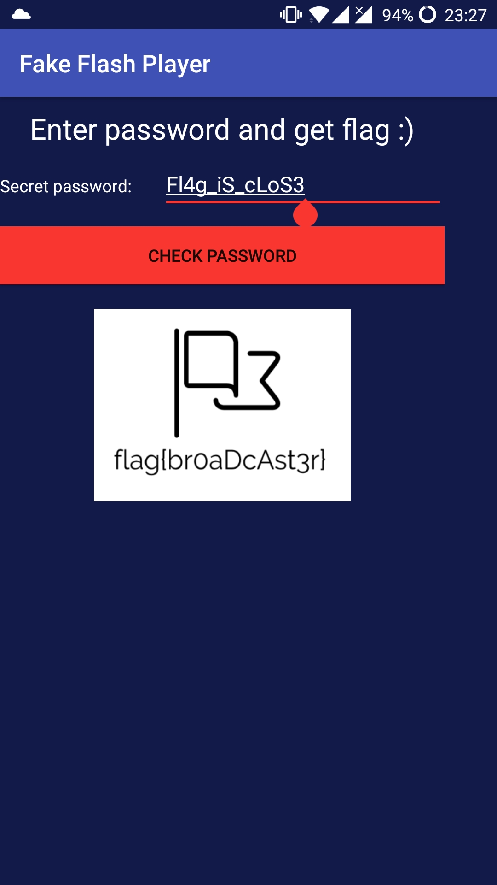

# Suspicious SMS
This challenge was for 250 points and the category was CERT (but it's really an RE challenge). The challenge text is reproduced as I remember it. Every contestant had workstation with installed Kali linux. At least basic understanding of how Android apps work is very helpful, but not necessary. 
## Challenge
Several members of company have received suspicious SMS message containing URL. Later several phones running Android OS were discovered to be infected.
URL: http://sms.certgames.pl
## 1. Obtaining APK
 Visiting the link from the challenge text has returned 404 error page. Since the challenge text points that only Android phones were infected I have changed the browser User-Agent to match Android.  I used [User-Agent switcher](https://addons.mozilla.org/en-US/firefox/addon/user-agent-switcher-revived/) Firefox extension.
 
After switching User-Agent to Android the webserver returned phishing site saying Flash player was outdated and needs to be upgraded. The site contained link to download [APK](githubapk) and instructions on how to enable third-party app installation on Android.

## 2. Analyzing APK
To analyze the APK we will use [apktool](https://ibotpeaches.github.io/Apktool/), [d2j-dex2jar.sh](https://github.com/pxb1988/dex2jar/releases/tag/2.0) and [JD-GUI](http://jd.benow.ca/). Be sure to have the latest version of apktool available older versions won't work. Also for JD-GUI to work Oracle Java is necessary.

First we extract the contents of the apk using
`$ apktool d flashplayer.apk`
This will give you almost everything you need. It extracts the apk converts manifests from binary to text form and transforms classes.dex into smali.
 
Checking AndroidManifest.xml and glancing over smali code can give you a pretty good idea that the apk is not malicious and can be installed on phone instead of going through the hustle of setting up Android SDK and emulator. Just to be sure I also confirmed this with the organiser. 

AndroidManifest.xml shows that there are two activities in the APK. We can identify the starting activity by looking for.
 `<action  android:name="android.intent.action.MAIN"/>` 
 ```xml
<?xml version="1.0" encoding="utf-8" standalone="no"?><manifest xmlns:android="http://schemas.android.com/apk/res/android" package="com.podejrzany.sms" platformBuildVersionCode="25" platformBuildVersionName="7.1.1">
    <meta-data android:name="android.support.VERSION" android:value="25.3.1"/>
    <application android:allowBackup="true" android:icon="@mipmap/ic_launcher" android:label="@string/app_name" android:roundIcon="@mipmap/ic_launcher" android:supportsRtl="true" android:theme="@style/AppTheme">
        <activity android:name="com.podejrzany.sms.Flag">
            <intent-filter>
                <action android:name="android.intent.action.MAIN"/>
                <category android:name="android.intent.category.LAUNCHER"/>
            </intent-filter>
        </activity>
        <receiver android:enabled="true" android:name="com.podejrzany.sms.Catcher">
            <intent-filter android:priority="999">
                <action android:name="tell.me.password"/>
            </intent-filter>
        </receiver>
    </application>
</manifest>
```

So the main activity that gets started is ***com.podejrzany.sms.Flag***. App also contains second activity called ***com.podejrzany.sms.Catcher***.

The second thing we will do is convert classes.dex into jar file so we can use JD-GUI decompiler. 
```
$ unzip -p flashplayer.apk classes.dex > classes.dex
$ d2j-dex2jar.sh -o classes.jar classes.dex
```
We start by examining the *Flag* class. The interesting part is the ***onClick*** listener for the button. It loads asset *flag* and calls ***Crypto.d*** function on it and tries to display it as and image. If the decryption of the flag image fails, exception is thrown and *logo.png* is displayed.
```java
...
localObject = Flag.this.getAssets().open("flag");
...
paramAnonymousView = new ByteArrayInputStream(Crypto.d("9876543210abcdef".getBytes(), arrayOfByte, paramAnonymousView));
```
We will now examine *Crypto* class. Class contains two static methods. We can see that the ***Crypto.d*** which is used for decryption of the flag is an AES-CBC decryption method. The *9876543210abcdef* from the *Flag* class is the IV and *arrayOfBytes* is our password.
```java
  public static byte[] d(byte[] paramArrayOfByte1, byte[] paramArrayOfByte2, byte[] paramArrayOfByte3)
    throws UnsupportedEncodingException, NoSuchAlgorithmException, NoSuchPaddingException, InvalidKeyException, InvalidAlgorithmParameterException, IllegalBlockSizeException, BadPaddingException
  {
    paramArrayOfByte1 = new IvParameterSpec(paramArrayOfByte1);
    paramArrayOfByte2 = new SecretKeySpec(paramArrayOfByte2, "AES");
    Cipher localCipher = Cipher.getInstance("AES/CBC/PKCS5Padding");
    localCipher.init(2, paramArrayOfByte2, paramArrayOfByte1);
    return localCipher.doFinal(paramArrayOfByte3);
  }
}
``` 
Now attacking AES is clearly not the solution. The challenge must have an easy non-time consuming solution. The *Crypto* class also contains ***Crypto.c*** method. This is obviously an XOR cipher. It sort of stands out in the code and I will return to it later.

Now earlier while examining the smali code I noticed string ***secr3t*** in one of the files. This string is in the *Catcher* class. As we can see the class contains hints. 
```java
public class Catcher
  extends BroadcastReceiver
{
  public void onReceive(Context paramContext, Intent paramIntent)
  {
    if (paramIntent.getExtras() != null) {
      try
      {
        Log.i("[HINT]", Crypto.c(new String(Base64.decode(paramIntent.getStringExtra("secr3t"), 0))));
        return;
      }
      catch (Exception paramContext)
      {
        Log.i("[HINT]", "It was supposed to be a secret");
        return;
      }
    }
    Log.i("[HINT]", "Give me something extra!");
  }
}
``` 
This is the second activity specified in AndroidManifest.xml. In Android when one activity wants to pass values to another it is added as an *Extra* to the intent that creates the activity. The extra must have a name specified. If the value passed is a string you can obtain it by calling *getStringExtra(extraName)* on the intent.  We can see that *Catcher* activity will call ***Crypto.c*** on an Base64 encoded extra string called ***secr3t***.

There is really no point in trying to execute this code. It will just encrypt the string passed to it. 

Last thing we have not examined is the *R* class. This class is automatically generated and contains ID references to strings and assets used in the app if they weren't hardcoded, but properly placed for example into strings.xml. The whole thing is properly explained in Android [documentation](https://stuff.mit.edu/afs/sipb/project/android/docs/guide/topics/resources/accessing-resources.html). Class is quite long and contains a lot of generated stuff. So we can just Ctrl-F for words like *pass* or *flag*.

Doing this we will find 3 strings called *Password*, *OtherPassword* and *AnotherPassword*. Lets explore what the strings contain. As I said the *R.class* contains references. The values can be found in */res/values/strings.xml*.
```xml
<string name="AnotherPassword">D2Z9bRZjGlUqRiZZeg==</string>
<string name="OtherPassword">SH1uFloJeTp9eXgt</string>
<string name="Password">fhtzFmsHOj1CengWWgl5On15eC0=</string>
```
Now these are obviously Base64 encoded strings. They were probably produced by similar fashion like the one in *Carcher* class mentioned earlier. Since it should be only Base64 and XOR cipher the same function could be used for decoding them.

Now lets return to ***Crypto.c*** and modify it. Like this:
 ```java
 import java.util.Base64;
public class Decrypt {

    public static void main(String[] args) {
		String input = "fhtzFmsHOj1CengWWgl5On15eC0=";

		String paramString = new String(Base64.getDecoder().decode(input));
		int i = paramString.length();
		char[] arrayOfChar = new char[i];
		int j = i - 1;
		for (i = j;; i = j)
		{
		  int k=0;
		  if (j >= 0)
		  {
		    j = paramString.charAt(i);
		    k = i - 1;
		    arrayOfChar[i] = ((char)(j ^ 0x49));
		    if (k >= 0) {}
		  }
		  else
		  {
		    System.out.println(arrayOfChar);
			return;
		  }
		  j = k - 1;
		  arrayOfChar[k] = ((char)(paramString.charAt(k) ^ 0xA));
		}
    }

}
```
I copied the decompiled output, fixed the uninitialized *k* variable, added Base64 decoder and instead of return used println. During the CTF I used [jdoodle](https://www.jdoodle.com/online-java-compiler). It's a handy online Java editor and is able to run the code too.

The output for ***fhtzFmsHOj1CengWWgl5On15eC0=*** is ***tRy_aN0tH3r_P@ssw0rd***. Great! Just to be sure we try this in the app and it is incorrect. So OtherPassword ***SH1uFloJeTp9eXgt*** gives us ***B4d_P@ssw0rd***. Okay so it must be the last password. Using ***D2Z9bRZjGlUqRiZZeg==*** we get: 
```
Exception in thread "main" java.lang.StringIndexOutOfBoundsException: String index out of range: -1
	at java.base/java.lang.StringLatin1.charAt(StringLatin1.java:44)
	at java.base/java.lang.String.charAt(String.java:692)
	at Decrypt.main(Decrypt.java:27)
Command exited with non-zero status 1
```
Oops.
Well the code seems to work fine on two passwords why is this not working? It surely must be the flag password. Well lets do what any programmer would do. Lets add some debug printlns. Add `System.out.println(arrayOfChar);`after line `arrayOfChar[k] = ((char)(paramString.charAt(k) ^ 0xA));`
Now lets run this:
```
S3
LoS3
_cLoS3
iS_cLoS3
g_iS_cLoS3
l4g_iS_cLoS3

Exception in thread "main" java.lang.StringIndexOutOfBoundsException: String index out of range: -1
	at java.base/java.lang.StringLatin1.charAt(StringLatin1.java:44)
	at java.base/java.lang.String.charAt(String.java:692)
	at Decrypt.main(Decrypt.java:27)
Command exited with non-zero status 1
```
Okey so the password is intentionally corrupted. But you can guess what the first letter should be. It's either f or F. (F actually). ***Fl4g_iS_cLoS3***


## Conclusion
This is was in my opinion a moderate difficulty challenge. I have only very basic experience in both Android development and RE. No smali patching and repackaging the app is required. It took me about three hours. Most of it was trying to execute Catcher with the Extra parameter, which is in the end useless for the solution.

 Although there were harder challenges in the CTF, when I checked the results at the end of the CTF I was the only one who got this flag. That's the main reason I think it deserves a write-up.
