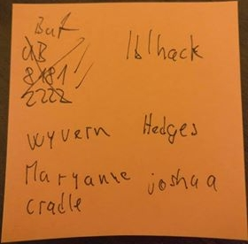
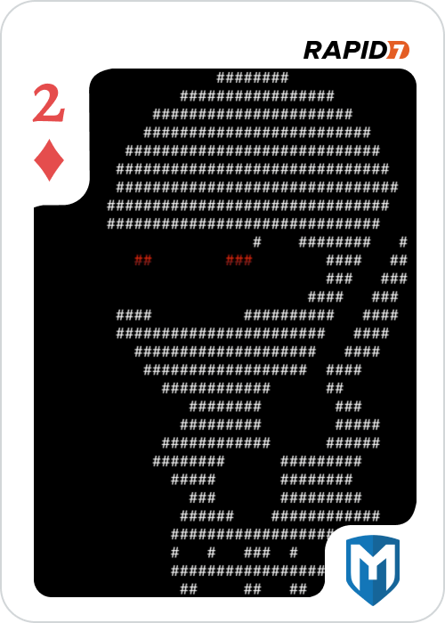

# 2 of Diamonds
This challenge was for 100 points as every other challenge. The flag was a picture of ascii-art commandline ninja from 
Metasploit Framework. 
## Challenge
Challenge started at port 25 or 79 of Ubuntu target.

## 1. Gaining foothold
Banner of port 25 revealed that the service is Sendmail (5.51/5.17) running on machine with hostname 2-of-diamonds. 
Quick search reveals that this version of sendmail is vulnerable to 
[Debug Mode Shell Escape](https://www.rapid7.com/db/modules/exploit/unix/smtp/morris_sendmail_debug) 
used by the infamous Morris worm in 1988.

After using the exploit I have obtained reverse shell on the machine as user daemon. After a quick enumeration I have 
realised that this is an old BSD (4.3 BSD UNIX). It is a nice simulation of old VAX computers. 

## 2. Privilege escalation
Firstly I have grabbed the `/etc/passwd` file. In such old version of BSD the file still contained the password hashes.

```
cat /etc/passwd
root:*:0:10:Charlie &:/:/bin/csh
toor:*:0:10:Bourne-again Superuser:/:
daemon:*:1:31:The devil himself:/:
operator::2:28:System &:/usr/guest/operator:/bin/csh
uucp::66:1:UNIX-to-UNIX Copy:/usr/spool/uucppublic:/usr/lib/uucp/uucico
nobody:*:32767:9999:Unprivileged user:/nonexistent:/dev/null
notes:*:5:31:Notesfile maintainer:/usr/spool/notes:/bin/csh
karels:QOrZFUGpxDUlo:6:10:Mike &:/usr/guest/karels:/bin/csh
sam:Yd6H6R7ejeIP2:7:10:& Leffler:/usr/guest/sam:/bin/csh
wnj:ZDjXDBwXle2gc:8:10:Bill Joy:/usr/guest/wnj:/bin/csh
mckusick:6l7zMyp8dZLZU:201:10:Kirk &:/usr/guest/mckusick:/bin/csh
dmr:AiInt5qKdjmHs:10:31:Dennis Ritchie:/usr/guest/dmr:
ken:sq5UDrPlKj1nA:11:31:& Thompson:/usr/guest/ken:
shannon:NYqgD2jjeuozk:12:31:Bill &:/usr/guest/shannon:/bin/csh
peter:y5G5mbEX4HhOY:13:31:peter b. kessler:/usr/guest/peter:/bin/csh
kre:vpyVBWM3ARc0.:14:31:Robert Elz:/usr/guest/kre:/bin/csh
ingres:64c19dZOElp9I:267:74:& Group:/usr/ingres:/bin/csh
ralph:s.EZm/wQTqbro:16:31:& Campbell:/usr/guest/ralph:/bin/csh
linton:1/WWIjn5Sd8qM:19:31:Mark &:/usr/guest/linton:/bin/csh
sklower:p0taJy06Qye1g:20:31:Keith &:/usr/guest/sklower:/bin/csh
eric:PcEfNNJN.UHpM:22:31:& Allman:/usr/guest/eric:/usr/new/csh
rrh:lj1vXnxTAPnDc:23:31:Robert R. Henry:/usr/guest/rrh:/bin/csh
arnold:5vTJh54EqjZsU:25:31:Kenneth C R C &:/usr/guest/arnold:/bin/csh
jkf:G6cip/I8C792U:26:31:John Foderaro:/usr/guest/jkf:/bin/csh
ghg:FA/4weg1/wy2c:32:31:George Goble:/usr/guest/ghg:/bin/csh
bloom:n0QtVD80F82MM:33:10:Jim &:/usr/guest/bloom:/bin/csh
miriam:hnZ1ZK5H2qapE:36:10:& Amos:/usr/guest/miriam:/bin/csh
kjd:ogYPQZGnihezk:37:10:Kevin Dunlap:/usr/guest/kjd:/bin/csh
rwh:LReNSwE9gQF7w:38:10:Robert W. Henry:/usr/guest/rwh:/bin/csh
tef:OciUqGHcs9YOw:39:31:Thomas Ferrin:/usr/guest/tef:/bin/csh
van:STpwu/Ggmk78A:40:31:& Jacobson:/usr/guest/van:/bin/csh
rich:uxxJaRZvgyiPg:41:31:& Hyde:/usr/guest/rich:/bin/csh
jim:.6s.pzMqjyMrU:42:10:& McKie:/usr/guest/jim:/bin/csh
donn:5cJ5uHclmVJKA:43:31:& Seeley:/usr/guest/donn:/bin/csh
falcon:.MTZpW8TC8tqs:32766:31:Prof. Steven &:/usr/games:/usr/games/wargames
hunter:IE4EHKRqf6Wvo:32765:31:Hunter Hedges:/usr/guest/hunter:/bin/sh
```

Here I have noticed first interesting account `falcon`. I noticed that the user does have a strange home directory 
`/usr/games` and shell assigned `/usr/games/wargames`. Now I have checked the home folders of other users in 
`/usr/guest`. One of them did stand out. I couldn't access the home folder of user hunter. 

Now I have tried to crack the passwords using `john`. Most of the passwords were cracked immediately. Hunter is the one
I was mostly interested in. After some time the password is cracked: ***msfhack***. Now I can escalate to hunter using
```
su hunter
Password:msfhack
```

I have examined the contents of hunters home folder.

```
ls -la /usr/guest/hunter
total 18
drwx------  2 hunter        512 Nov  6 18:19 .
drwxr-xr-x  7 root          512 Nov  6 18:19 ..
-rw-------  1 hunter         13 Nov  6 18:19 .history
-rws--x--x  1 root        15360 Nov  6 18:19 movemail
```

The movemail binary with set SUID bit is definitely something I have to use. Since mail is mentioned so many times
so far I have decided to try and read hunter's mail.

```
mail
From cliff Wed Sep 10 12:34:42 1986
Received: by 2-of-diamonds (5.51/5.17)
	id AA00579; Wed, 10 Sep 86 12:34:42 PDT
Date: Wed, 10 Sep 86 12:34:42 PDT
From: cliff (Cliff Stoll)
Message-Id: <8610210434.AA00579@2-of-diamonds>
To: mcnatt@26.0.0.113
Subject: What do you know about the nesting habits of cuckoos?
Status: RO

He went looking for your Gnu-Emacs move-mail file.

?
``` 

That is a very important hint. It is actually a reference to book [The Cuckoo's Egg](https://en.wikipedia.org/wiki/The_Cuckoo%27s_Egg).
The summary mentions a vulnerability in movemail function of GNU Emacs. Searching and testing bit shows that the vulnerability 
allows the attacker to create new files as root. You can also remove contents of the file, but it won't remove the file itself.
Also appending to already existing file is not possible. (At least in this challenge.)

In the book the attacker used this exploit to replace the `atrun` binary. This is not possible in my case, but I can take
similar approach and create `/usr/lib/crontab.local`. The payload can be various, but the easiest thing to do is to copy
the sh binary and set SUID bit. Some shells like ksh or sh don't drop SUID on execution. I tried to write my own exploit, but then
I noticed a new PR request to metasploit framework which actually added the exploit. So I just installed
[Emacs movemail Privilage Escalation](https://www.rapid7.com/db/modules/exploit/unix/local/emacs_movemail) exploit and added
it to the framework.

The exploit does the same thing I have been trying to do and gave me root shell.

## 3. Getting the flag.
So far the path was pretty straight forward. I tried to use `find` to look for files with png extension but that failed.
I have now continued with the weird `falcon` user and checked `/usr/games`. At this point I have noticed that the game
`adventure` can be executed only by root, but I dismissed it as unimportant. This was big mistake and I lost a whole
day just on trying to figure out what to do next.

```
ls -la /usr/games
drwxr-xr-x  3 root         1024 Jun  6 06:59 .
drwxr-xr-x 24 root          512 Nov  6 18:18 ..
-rwxr-xr-x  1 root           42 Jun  6 06:53 aardvark
-rwx------  1 root       163863 Nov  6 18:19 adventure
-rwxr-xr-x  1 root        10240 Jun  6 06:58 arithmetic
-rwxr-xr-x  1 root        45056 Jun  6 06:54 backgammon
-rwxr-xr-x  1 root        19456 Jun  6 06:58 banner
-rwxr-xr-x  1 root       195584 Jun  6 06:54 battlestar
-rwxr-xr-x  1 root         7168 Jun  6 06:58 bcd
-rwxr-xr-x  1 root        78710 Jun  6 00:14 bogdict
-rwxr-xr-x  1 root        24576 Jun  6 06:54 boggle
-rwxr-xr-x  1 root        19456 Jun  6 06:58 btlgammon
-rwxr-xr-x  1 root        37888 Jun  6 06:58 canfield
-rwxr-xr-x  1 root        16384 Jun  6 06:58 cfscores
-rwxr-xr-x  1 root         7168 Jun  6 06:58 chess
-rwxr-xr-x  1 root          283 Jun  6 06:54 ching
-rwxr-xr-x  1 root        39936 Jun  6 06:55 cribbage
-rwxr-xr-x  1 root        26016 Jun  6 00:27 doctor
-rwxr-xr-x  1 root        11264 Jun  6 06:58 factor
-rwxr-xr-x  1 root        12288 Jun  6 06:58 fish
-rws--x--x  1 daemon      14336 Jun  6 06:55 fortune
-rwxr-xr-x  1 root        27648 Jun  6 06:56 hangman
-rwxr-xr-x  1 root        37888 Jun  6 06:56 hunt
drwxr-xr-x  4 root          512 Dec  2 11:17 lib
-rwxr-xr-x  1 root        44032 Jun  6 06:56 mille
-rwxr-xr-x  1 root        37736 Jun  6 06:56 monop
-rwxr-xr-x  1 root         9216 Jun  6 06:58 number
-rwxr-xr-x  1 root        11264 Jun  6 06:58 primes
-rwxr-xr-x  1 root        12288 Jun  6 06:56 quiz
-rwxr-xr-x  1 root        15360 Jun  6 06:58 rain
-rws--x--x  1 daemon      35840 Jun  6 06:56 robots
-rws--x--x  1 daemon     113664 Jun  6 06:57 rogue
-rwsr-xr-x  1 daemon      83968 Jun  6 06:57 sail
-rwsr-xr-x  1 daemon      36864 Jun  6 06:57 snake
-rwxr-xr-x  1 daemon      15360 Jun  6 06:57 snscore
-rwxr-xr-x  1 root        54272 Jun  6 06:54 teachgammon
-rwxr-xr-x  1 root        60416 Jun  6 06:57 trek
-rwxr-xr-x  1 root          909 Jun  6 06:57 wargames
-rwxr-xr-x  1 root        23552 Jun  6 06:59 worm
-rwxr-xr-x  1 root        17408 Jun  6 06:59 worms
-rwxr-xr-x  1 root        13312 Jun  6 06:58 wump
-rwxr-xr-x  1 root         9216 Jun  6 06:57 zork
```

I also checked the `/usr/games/lib` directory where the flag was finally found. The flag 2_of_diamonds.dat file.

```
-rw-rw-rw-  1 root            0 Jun 21  1985 battlestar.log
drwxr-xr-x  2 root         1024 Jun 23  1985 quiz.k
-rw-r--r--  1 daemon          0 Jun 23  1985 saillog
-rw-r--r--  1 daemon          0 Jun 23  1985 snakerawscores
-rwxr-xr-x  1 root       222180 Jun  5 23:26 aard
-rwxr-xr-x  1 root        82944 Jun  6 00:18 compat
-rw-------  1 daemon     401624 Jun  6 00:29 fortunes.dat
-rw-rw-r--  1 root         2115 Jun  6 01:13 cards.pck
drwxr-xr-x  2 root          512 Jun  6 06:54 ching.d
-rw-r--r--  1 root        11742 Jun  6 06:55 crib.instr
-rwxr-xr-x  1 root        29696 Jun  6 06:55 ddlrun
-rwxr-xr-x  1 root        30720 Jun  6 06:56 hunt.driver
-rw-r--r--  1 daemon          0 Jun  6 06:56 robots_roll
-rw-r--r--  1 daemon          0 Jun  6 06:57 rogue_roll
-rwxr-xr-x  1 daemon          0 Jun  6 06:57 dindex.dat
-rwxr-xr-x  1 daemon     228864 Jun  6 06:57 dtext.dat
-rwxr-xr-x  1 daemon     109056 Jun  6 06:57 doverlay
-rwxr-xr-x  1 daemon      54652 Jun  6 06:57 dungeon
-rwxr-xr-x  1 root        19036 Jun  6 06:59 chess
-rwxrwxrwx  1 root            0 Jun  6 06:59 cfscores
-rw-------  1 root       131776 Nov  6 18:22 2_of_diamonds.dat
```

I exfiltrated the flag first by using `od -x` to make hex dump (`od` is older brother of `xxd` command). Then I found a 
better more reliable way of using `uuencode` and `uudecode`.

Using binwalk on the file yield no results. The entropy suggests that the file is encrypted. I strongly suspected 
that the file was encrypted using `crypt` command simply because nothing else encryption related seems to be on the machine.

At this point I was stuck for several hours. I started to write all passwords from the book onto sticky notes
to try and use them on the file together with crypt, but eventually stopped because there were too many of them and this seemed
like a long shot anyway. I also looked into crakcing `crypt`. It should not be a particularly strong encryption but the methods
available for cracking were not going anywhere.



After nearly two days, with the challenge still unsolved mods at ctf-support-2018 slack channel started dropping hints.
At some point a joke/hint (at least I believe it was a hint) showed that the [Glenda](https://9p.io/plan9/glenda.html) bunny 
had probably the same designer as the [Go Gopher](https://blog.golang.org/gopher). This has somehow lead me to the PDP-11
and the documentation of [a.out](https://en.wikipedia.org/wiki/A.out) executable format (and yes it is an
executable file format not just a default name linker gives to executables as most people think).

Then after several hours another hint was dropped saying: "This is a colossal challenge" (This was before any official
hints appeared in CTFd framework challenge description). It immediately lead me to the [Colossal Cave Adventure](https://en.wikipedia.org/wiki/Colossal_Cave_Adventure)

Now I have remembered that the file had different permissions and this should have been a dead giveaway straight out.

First I tried to run strings at the binary and noticed that there are words flag and diamonds present. I exfiltrated the 
file and tried to reverse engineer it. IDA Pro did identify that the file is in a.out format, but it ended there. 

radare2 was not helpful either and I haven't had BinaryNinja instance at hand, but I doubt it would make a difference.
The only remaining thing to do was to play the game. 

Now if you haven't played text-based rouge-like adventure games before (like me) this won't be easy. The game is hard.
Getting used to the game mechanics takes time (I hate dwarfs). I used a [walkthrough](http://ifarchive.jmac.org/if-archive/solutions/adventure-walkthrough.txt).

Now I was racing to the end to finish the game. I have finished it and nothing happened. I wasn't paying particular attention
to the text which was again a mistake. So I replayed the game now reading the text more carefully. I was sort of expecting 
that the flag would be somewhere near the end the game. This time I have noticed that when I type `flag` it does give me
`There is no flag here.` So now I was looking for an ingame item. About half-way through the game, when you encounter the
dragon I have noticed that the text mentions flag.

```
With what?  Your bare hands?
yes

Congratulations!  You have just vanquished a dragon with your bare
Hands!  (unbelievable, isn't it?)

You are in a secret canyon which exits to the north and east.

There is a persian rug spread out on the floor!

The body of a huge green dead dragon is lying off to one side.

There is a flag here.
flag
What do you want to do with the flag?
read

I'm afraid I don't understand.
flag decrypt

I don't know that word.
get flag

OK

```

If you haven't played the game, the point is to find treasures like diamonds, jewels, persian rug etc. and bring and drop
them in building (a place near start of the game). So I have tried to do the same with the flag.

```
You're at "y2".
plugh

You're inside building.

Off to one side lies a glistening pearl!

There is a jewel-encrusted trident here!

There are rare spices here!

There is a golden chain lying in a heap on the floor!

There is a large sparkling nugget of gold here!

There are bars of silver here!

There is precious jewelry here!

There are many coins here!

There is a platinum pyramid here, 8 inches on a side!
drop flag

Congratulations! You have completed the 2 of Diamonds challenge.
The crypt(1) password for 2_of_diamonds.dat is `wyvern'.

A large cloud of green smoke appears in front of you.  It clears away
to reveal a tall wizard, clothed in grey.  He fixes you with a steely
glare and declares, "this adventure has lasted too long."  With that
he makes a single pass over you with his hands, and everything around
You fades away into a grey nothingness.
```

Amazing after nearly three days I finally had the password and they were using crypt as I suspected! Hold on a second that
password it looks strangely familiar. (Looks at the sticky note) God damnit! (Continues saying profanities for 5 minutes)

I had the password the whole time! If I had gone through with my original plan it would have worked!

Anyway to give you some context about what the password means an here is part of chapter 2:

```
OK, how do you become privileged? The obvious way is to log onto our computer
with the system manager's password. We hadn't changed our password in months, but
nobody would have leaked it. And an outsider would never guess our secret password,
"wyvern"—how many people would think of a mythological winged dragon when guessing
our password?
```

Now I have decrypted the flag and exfiltrated it using `uuencode` 



By the way the official hint for this challenge that was released was [Xyzzy](https://en.wikipedia.org/wiki/Colossal_Cave_Adventure#Xyzzy)
This was big hint still some people struggled with it and asked me for advice.

## 3. Lessons learned.

I think I was about 4th person to get the flag (team name bc). I have spent way too much time on this, most of the CTF really.
I have still managed to get to 18th place overall. 

I have learned a lot about older UNIX systems,  PDP-11 and a.out. Learned that even in older systems people still faced similar
problems that we do and there was usually a tool for it. You don't have `xxd` or `base64`? Use `od` or `uuencode`.

The last thing is that if something feels out of place never disregard it, use your intuition. If I had done that I could have had
the flag first at least a day earlier save a lot of time and get a better ranking.

I would like to especially thank Warriar from Kasselhackt team for exchange of ideas on this and other challenges.